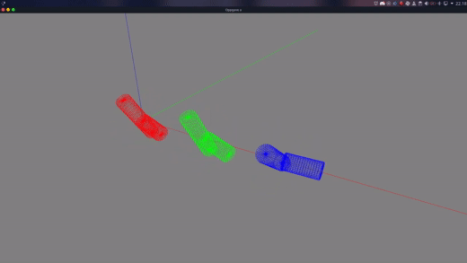

# Mathematics Project (TDAT3024)

## Members
* Tobias Meyer Andersen
* Kjerand Evje
* Dilawar Mahmood
* Håvard Stavnås Markhus
## Project Description
This project was a part of the couse [TDAT3024 - Mathematics and Physics, optional course ](https://www.ntnu.edu/studies/courses/TDAT3024#tab=omEmnet).

The project was to implement different numerical methods for solving differential equations, and use those solutions to simulate a spinning T-handle, as shown in the video below:

https://www.youtube.com/watch?v=1n-HMSCDYtM